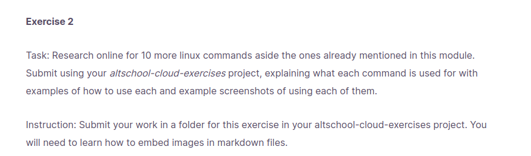
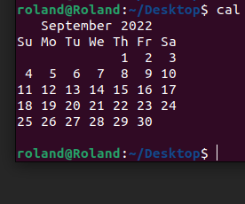
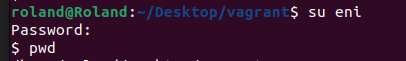
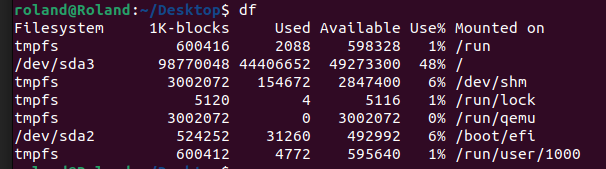
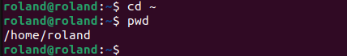
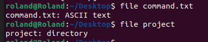
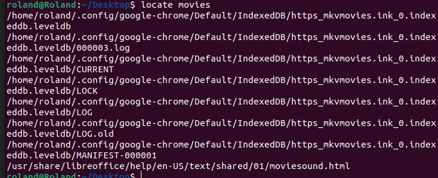

# Task 2

1. **cal**	 To Display calendar. 
2. **su**  To change user to root. 
3. **Whoami** Displays user. 
4. **df**	Checks the disk space in the system. 
5. **cd ~** To enter home directory 
6. **groups** 	Displays the group name to which the current user belongs to. 
7. **file**  Displays the type of file.
8. **locate** 	Searches a file. 
9. **exit** To exit a directory or root user.
10. **date** displays the current date. 
