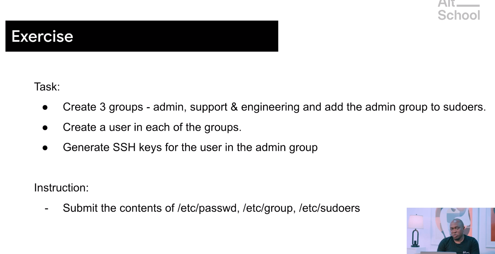
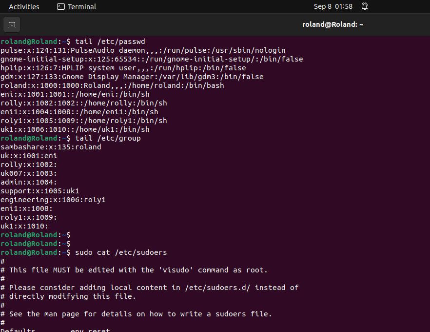
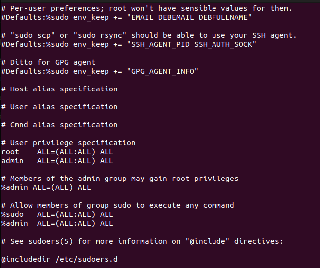

# Task 3

+ To create 3 groups -admin, support, and engineering 
+ Add the admin group to sudoers
+ create a user in each group.
+ Generate SSH keys for the users in the admin group.
+ submit the contents of /etc/passwd
+ submit the contents of /etc/group
+ screenshot of output

+ submit the content of /etc/sudoers
