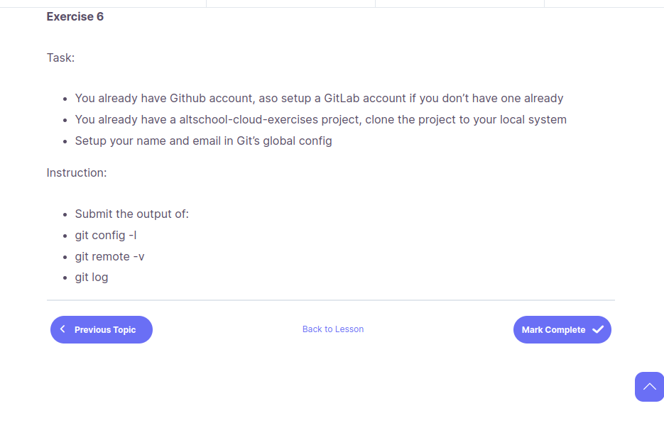
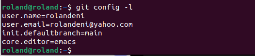
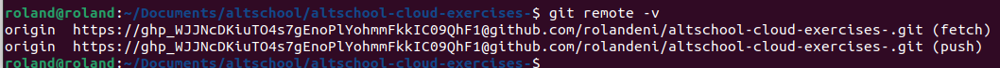
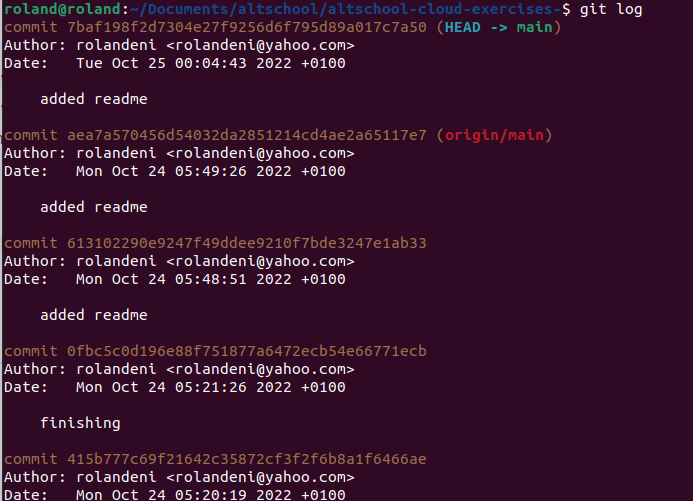

## Task 4

+ create a gitlab account.
+ clone your altschool repository to your local machine.
+ set up your name and email with git global config. 
+ submit the output of git config -i.

+ submit the output of git remote -v.

+ submit the output of git log. 

