# Task 6
## To review ten CIS benchmarks for Ubuntu and implement recommendations.
+ ### *The CIS benchmarks are sefety precautions or security guide lines to help keep a system or server safe and protected.*
### These are the recommdations that i carried out on my local machine.
1. To ensure mounting of freevxfs filesystem is disabled 
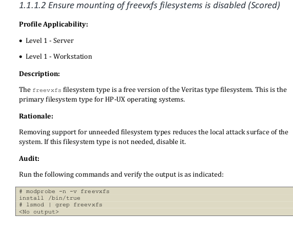
+ my local machine output.
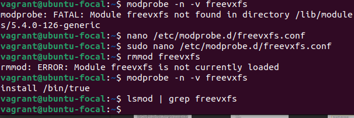

2. To ensure mounting of jffs2 filesystems is disabled.
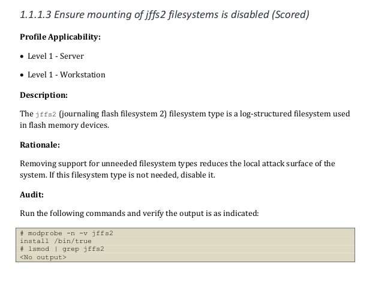
+ my local machine output.
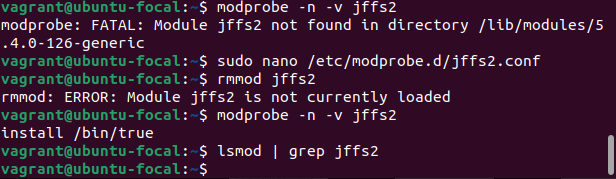

3. To ensure mounting of hfs filesystems is disabled.
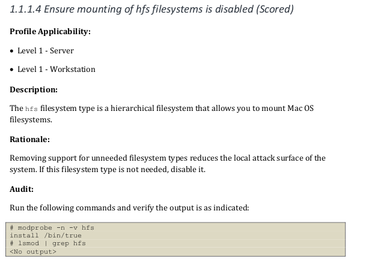
+ my local machine output.
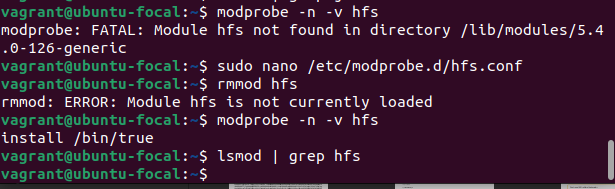

4. To ensure mounting of hfsplus filesystems is disable.
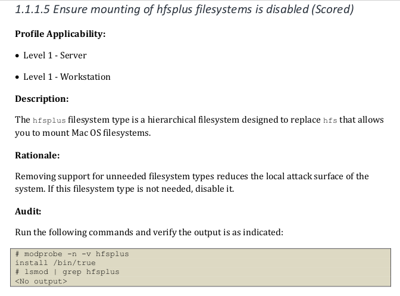
+ my local machine output.
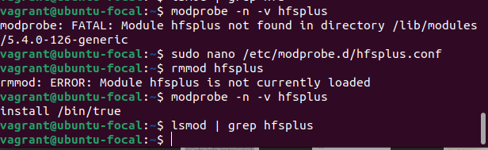

5. To ensure mounting of squashfs filesystems is disabled.
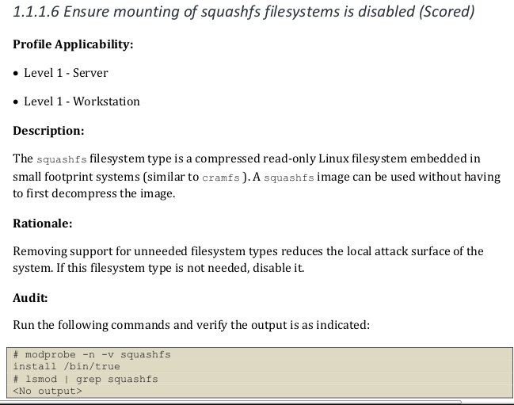
+ my local machine output.
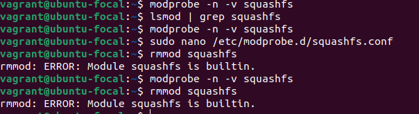

6. To ensure mounting of udf filesystems is disabled.
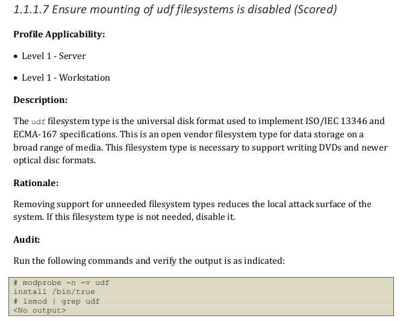
+ my local machine output.
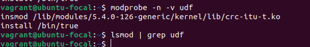

7. To ensure mounting of FAT filesystems is limited.
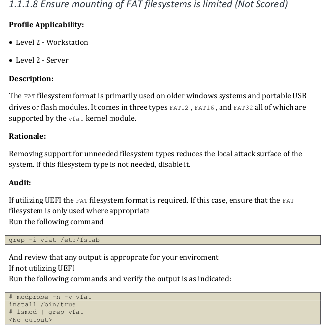
+ my local machine output.
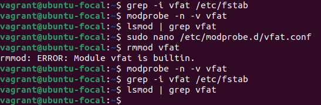

8. To ensure nodev option set on /tmp partition.
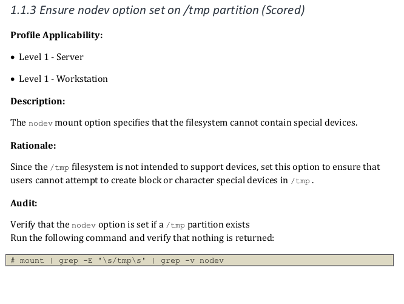
+ my local machine output.
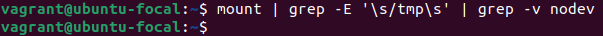

9. To ensure nosuid option set on /tmp partition.
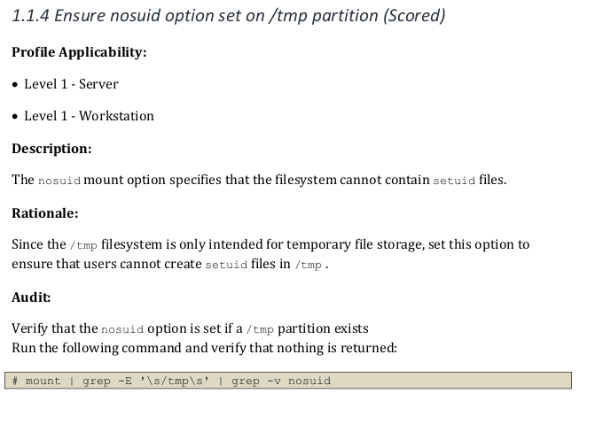
+ my local machine output.
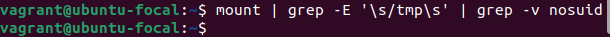

10. To ensure mounting of cramfs filesystems is disabled.
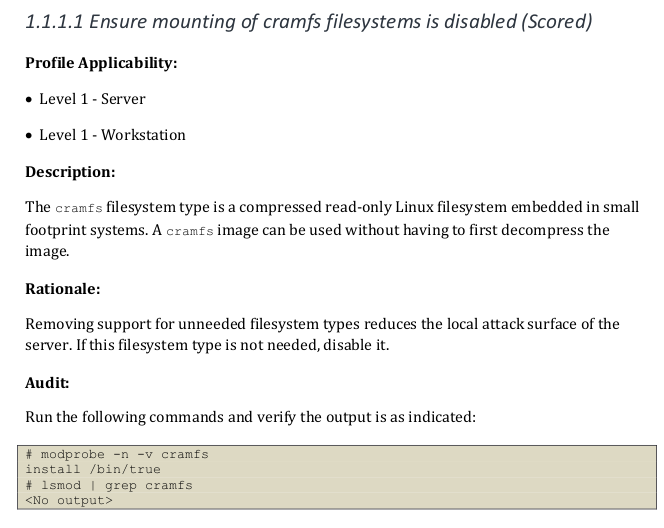
+ my local machine output.
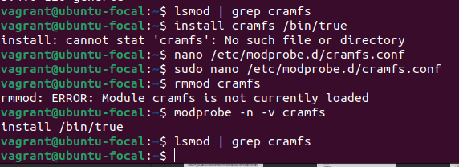

