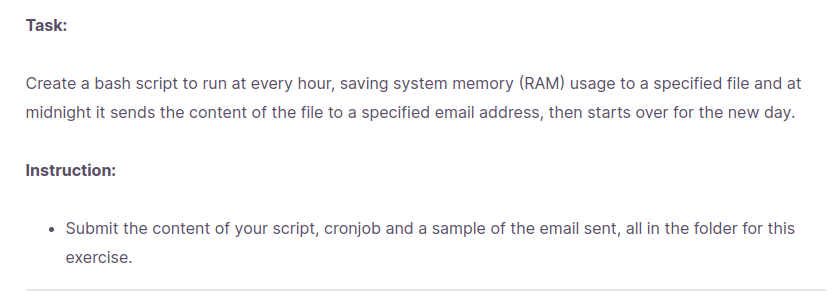
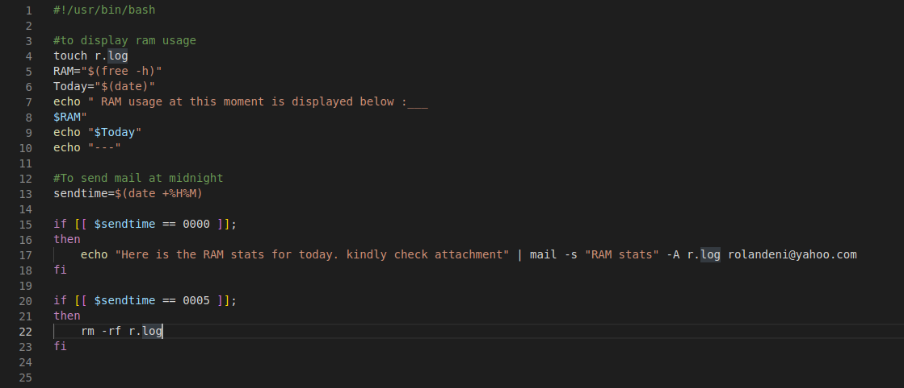
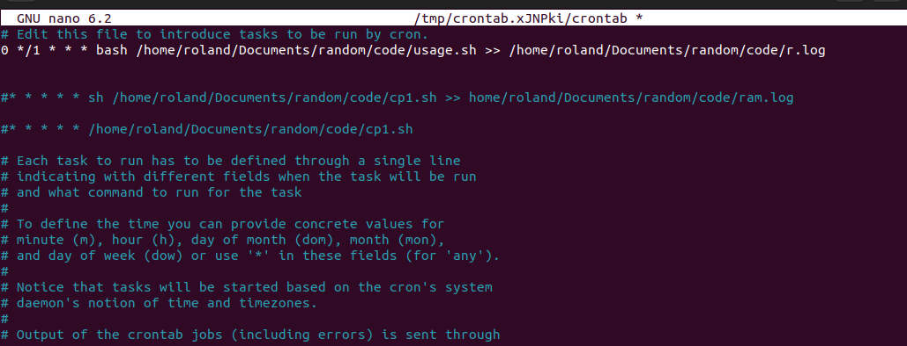
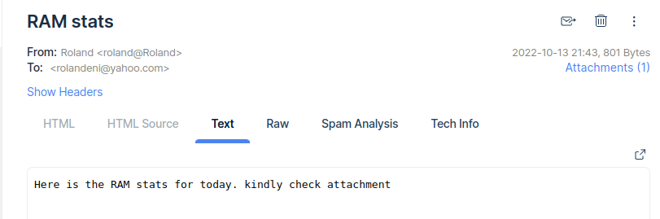

# Task 7
## To create a bash script that saves system memory to a specific file every 1 hour intervl and then sends an email at 12 midnight to an email, with the specified file as attachment. Then starts afresh again.

### Steps to carry this task out.
1. Create a bash script that saves RAM usage. on terminal
2.  Redirect the output of the script to a file. *example: r.log* 
3. Create a crontab job that executes the script every 1hour interval
4. Install **ssmtp** and **mailutils**, then configure **ssmtp.conf**
4. write code to send mail at midnight in bash script.
5. Test code and save file.

### **Implementation Process**
+ created a bash script that displays RAM usage using the command *free -h* 

+ created a cron job that runs the script *usage.sh* every 1hour interval.  and also sends the output to a specified file
+ added email command to bash script using *if* statement, then deletes the specified file after sending email.
+ The sent email.

**Task Complete**