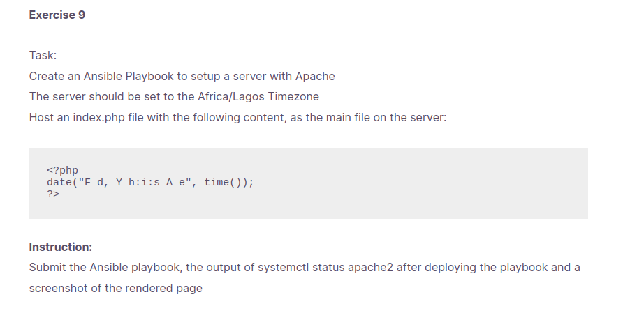
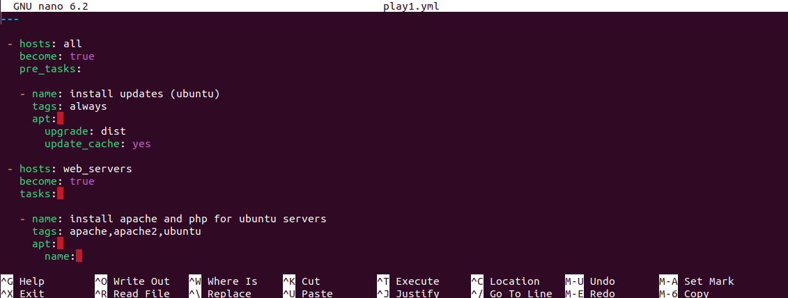
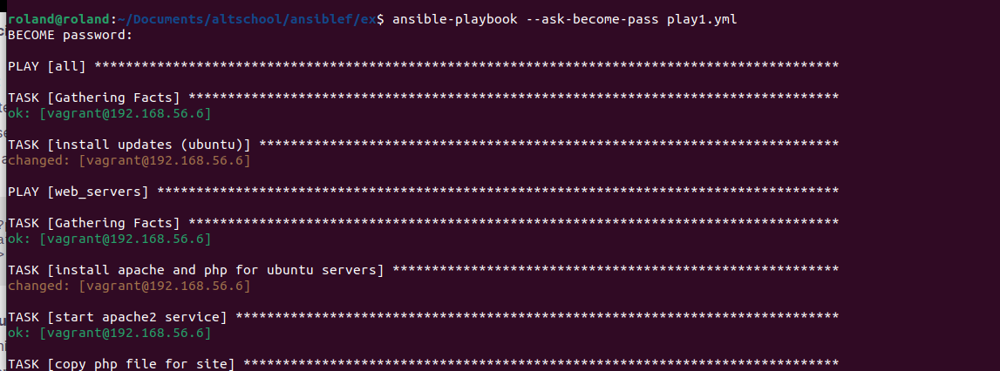
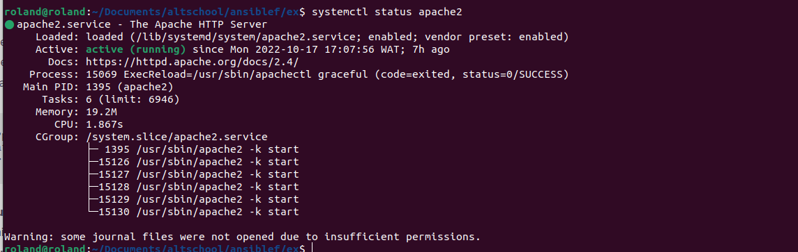
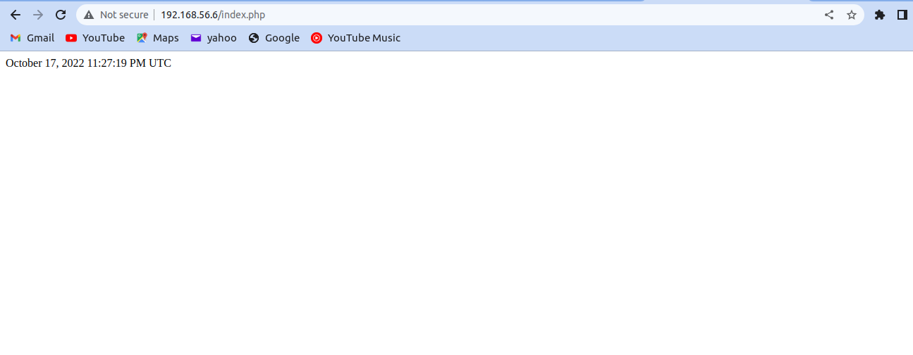

# Task 8
### To create Ansible play-book to setup  server with Apache.
### To set the server time to africa/lagos timezone.
### To host the below php file as the main file on the server.
 
### To submit the ansible playbook, the output of **systemctl status apache2**
### Steps to carry this task out
1. write ansible playbook script to carry out these tasks 
+ install apt 
+ update apt and upgrade
+ install apache 
+ install dependencies for Apache
+ copy php file to /var/www/html

2. create ssh key that connects host machine to remote machine. 
3. edit the /etc/hosts file on the remote server to contain the public ip of the remote server. 
4. Run the ansible script on host machine,  screenshot of Ansible script running.
 
5. ssh into remote server and run **systemctl status apache2**
 

6. php web output was a success. Time zone set

